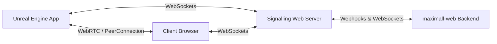

# Pixel Streaming Infrastructure & Custom Configurations

This document details the Unreal Engine Pixel Streaming infrastructure inside the `maximall-pixel-config` repository. It covers the core layout, customization to the signaling server, activity/idle-timeout mechanisms, and local build instructions.

---

## 1. High-Level Pixel Streaming Architecture

The pixel streaming layer is based on the Epic Games Pixel Streaming infrastructure templates (designed for UE5.6). It enables low-latency WebRTC streaming of Unreal Engine viewport rendering directly to web browsers.



- **Unreal Engine App**: Runs the packaged 3D room, rendering real-time frames. It communicates via WebSocket to the local signaling server and streams video/audio using WebRTC directly to the client browser.
- **Signalling Web Server**: A Node.js/TypeScript server managing WebRTC negotiations, player registry, and streamer routing. Exposes HTTP and WebSocket endpoints to both the client browser and the Unreal Engine streamer process.
- **Client Browser**: Displays the glassmorphic loading/waiting screen, connects to the signaling server, renders the WebRTC video stream, and captures user input (mouse, keyboard, touch) to send back to Unreal Engine.
- **maximall-web Backend**: The central orchestrator that manages EC2 instance lifecycles, pool size, user routing, and grace periods.

---

## 2. Custom Signaling Server Modifications

To integrate the standalone signaling instances with the main `maximall-web` orchestrator, several custom modifications were introduced in `SignallingWebServer/src/index.ts`.

### A. CommandLine Options & Configuration
The server CLI was extended with additional commander options:
- `--backend_url <url>`: The base URL of the main `maximall-web` backend (e.g., `https://your-domain.ngrok-free.dev`).
- `--instance_uuid <uuid>`: The unique identifier (EC2 Instance ID) of the hosting machine as registered in the backend's in-memory database.
- `--backend_secret <secret>`: Shared secret token used to authenticate webhook callback requests.

### B. Streamer Disconnection Webhook (`streamerRegistry` Events)
In the original Epic Games template, if the Unreal Engine streamer crashed or exited, the signaling server would remain running but became a "ghost instance" with no video feed, leaving the client stuck. 

To resolve this, we hook into the signaling server's `streamerRegistry` `'removed'` event:
```typescript
if (options.backend_url && options.instance_uuid) {
    signallingServer.streamerRegistry.on('removed', (streamerId: string) => {
        const url = `${options.backend_url}/api/instances/${options.instance_uuid}/streamer-disconnected`;
        Logger.info(`Notifying backend of streamer disconnect: streamer=${streamerId} url=${url}`);

        fetch(url, {
            method: 'POST',
            headers: { 'Content-Type': 'application/json' },
            body: JSON.stringify({
                streamerId,
                secret: options.backend_secret || ''
            }),
            signal: AbortSignal.timeout(5000) // 5s timeout
        })
        .then((res) => {
            if (!res.ok) {
                Logger.warn(`Backend notification returned non-OK status: ${res.status}`);
            } else {
                Logger.info(`Backend notified successfully`);
            }
        })
        .catch((err) => {
            Logger.error(`Failed to notify backend: ${err.message}`);
        });
    });
}
```
*Note: This webhook notifies the backend to immediately trigger the grace period countdown (or stop the instance), reclaiming EC2 resources and avoiding indefinite run costs.*

---

## 3. Frontend Activity & Idle Timeout Flow

To protect the server from idle users running GPU resources indefinitely, the frontend client implements user interaction tracking and a glassmorphic warning countdown modal.

### A. HTML / CSS Glassmorphic Modal
A premium dark overlay is embedded inside the player template (`Frontend/implementations/typescript/src/player.html`):
- **Selector**: `#idle-warning-overlay`
- **Design Elements**: Semi-transparent dark background (`rgba(10, 10, 15, 0.7)`), dynamic backdrop filter blur (`blur(12px)`), and a cards-based layout utilizing the Montserrat font with subtle gradients.
- **Interactivity**: Renders a countdown span (`#idle-countdown`) and a primary call-to-action button (`#idle-warning-btn`) labeled **"Я здесь!"** (I'm here!).

### B. Activity Monitoring Logic (`player.ts`)
The client monitors user interaction via the following DOM events:
- `mousemove`, `mousedown`, `keydown`, `touchstart`, `wheel`

The activity state is handled as follows:
1. **Normal State**: When the warning modal is **not** visible, user interactions are captured and debounced (500ms). The client transmits a periodic `user-activity` signal back to `maximall-web`'s WebSocket server to keep the session alive.
2. **Warning State**: Once the backend fires the `idle-warning` event, the warning modal is made visible. During this state, normal interactions (like moving the mouse or pressing keys) are **completely ignored** and will **not** close the modal.
3. **Explicit Dismissal**: The warning modal can only be dismissed when the user explicitly clicks the **"Я здесь!"** button. Clicking this button sends a forced activity signal to the backend and hides the overlay.
4. **Timeout Redirection**: If no response is received and the backend emits `idle-timeout` or `instance-stopping`, the frontend clears the session storage (`assignedUuid` and `global_hostToken`) and redirects the client back to the entry page (`index.html`).

---

## 4. Local Build & Compilation Sequence

The frontend is structured as a monorepo containing multiple local packages. To compile the changes and bundle the assets for the signaling web server:

1. **Clean prior build outputs**:
   ```powershell
   npm run clean --ws
   ```
2. **Build monorepo packages in dependency order**:
   Run the workspace-wide compilation command from the repository root:
   ```powershell
   npm run build:all:cjs
   ```
   This compiles:
   - `Common` package (exports `@epicgames-ps/lib-pixelstreamingcommon-ue5.6`)
   - `Signalling` package
   - `SignallingWebServer`
   - `Frontend/library`
   - `Frontend/ui-library`
   - `Frontend/implementations/typescript` (bundles the typescript `player.ts` asset via Webpack and outputs the ready `player.js` bundle to `SignallingWebServer/www/`)
